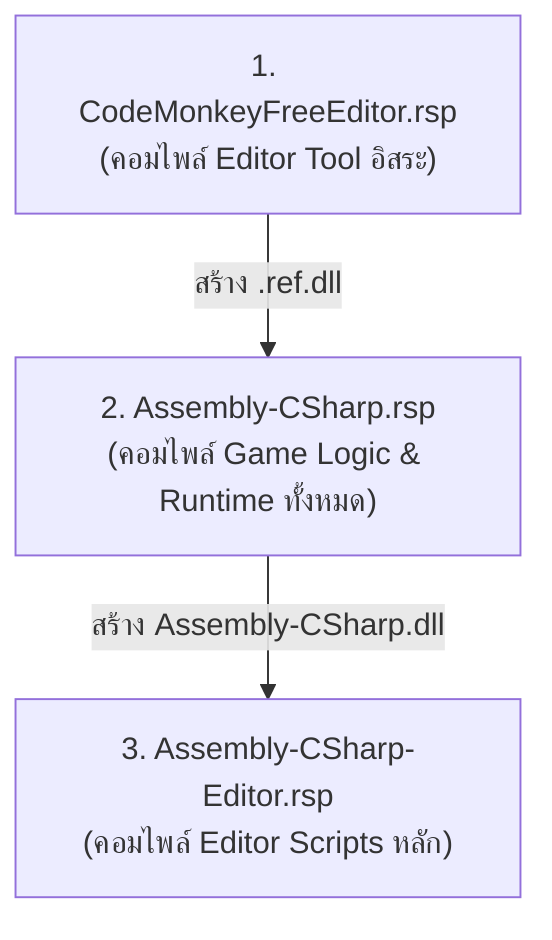

# 🛠️ คู่มือการดีแบ๊กและแนวทางการพัฒนาเกมสำหรับ AI Agents (CaDaCook)

คู่มือนี้จัดทำขึ้นเพื่อให้ **AI Agents ทุกตัว** ที่เข้ามาร่วมวิเคราะห์ แก้ไขบัค หรือพัฒนาโปรเจกต์ **CaDaCook** (Unity 6 C#) สามารถทำงานได้อย่างมีประสิทธิภาพสูงสุด ปฏิบัติตามมาตรฐานความปลอดภัย และวินิจฉัยปัญหาได้อย่างแม่นยำ รวดเร็ว โดยไม่ต้องเดาสุ่ม

---

## 🚨 1. กฎเหล็กด้านความปลอดภัยและข้อจำกัดสำหรับ AI Agents (Hard Constraints)

1. **ห้ามใช้คำสั่ง Git Commit หรือ Git Push เด็ดขาด (Rule 15 - No Auto-Commits):**
   - ห้ามรัน `git commit` หรือ `git push` ด้วยตนเองเด็ดขาด ผู้ใช้จะเป็นผู้ตรวจสอบโค้ดและ Commit ขึ้น GitHub ด้วยตนเองเสมอ
2. **ห้ามแก้ไขหรือยุ่งเกี่ยวกับฐานข้อมูลโดยตรง (Rule 14 - No Direct DB Writes):**
   - หากมีการเชื่อมต่อระบบ Database หรือ Backend ในอนาคต ให้จัดเตรียมคำสั่ง SQL หรือ API Schema ให้ผู้ใช้นำไปดำเนินการเองเท่านั้น
3. **ห้ามลบไฟล์หรือดึงแพ็กเกจใหม่โดยไม่ได้รับอนุญาต (Rule 13):**
   - ห้ามใช้คำสั่งลบที่อันตราย (`rm -rf`) และห้ามติดตั้ง Unity Packages ใหม่ผ่าน UPM เว้นแต่จะได้รับการอนุมัติอย่างชัดเจนจากผู้ใช้
4. **ปฏิบัติตามกฎเหล็ก 15 ข้อใน [`REFACTORCODE.md`](file:///c:/CaDaCooked/CaDaCookedScripts/markdowns/REFACTORCODE.md):**
   - แยก Game Logic ออกจาก Visual/Audio/UI ผ่าน C# Events (Rule 1)
   - ข้อมูลและสูตรอาหารต้องอยู่ใน ScriptableObjects (Rule 2)
   - ปฏิบัติตาม De Morgan's Laws & Early Return Guard Clauses ตามคู่มือ [`DeMorgansLaws.md`](file:///c:/CaDaCooked/CaDaCookedScripts/markdowns/DeMorgansLaws.md) (Rule 4)
   - **Zero GC Alloc** ในลูป `Update()` / `FixedUpdate()` (ห้าม `new` หรือต่อสตริงทุกเฟรม) (Rule 5)
   - ป้องกัน Memory Leak ด้วยการ Unsubscribe (`-=`) ใน `OnDestroy()` เสมอ (Rule 7)
   - เรียก C# Events ด้วย Safe Navigation `?.Invoke()` เสมอ (Rule 8)
   - ใช้ Unity New Input System ผ่าน `GameInput.cs` เท่านั้น (Rule 11)
5. **บันทึกประวัติการปรับปรุงลงใน [`LOG.md`](file:///c:/CaDaCooked/CaDaCookedScripts/markdowns/LOG.md) ทุกครั้ง:**
   - เมื่อทำการปรับปรุงโค้ดหรือเอกสาร ต้องสรุปผลลงใน `markdowns/LOG.md` เสมอ

---

## 💻 2. คำสั่งและขั้นตอนการคอมไพล์ผ่าน Unity Roslyn Compiler CLI (Compiler Diagnostic Guide)

AI Agent สามารถทดสอบการคอมไพล์โค้ด C# ได้โดยตรงผ่าน Terminal โดยไม่ต้องเปิดโปรแกรม Unity Editor ผ่าน Roslyn C# Compiler (`csc.exe`) ที่ฝังมากับ Unity 6000.3.6f1

### 2.1 ตำแหน่งของ Compiler และ Runtime บนเครื่อง
- **Mono Runtime:**
  ```text
  C:\Program Files\Unity\Hub\Editor\6000.3.6f1\Editor\Data\MonoBleedingEdge\bin\mono.exe
  ```
- **Roslyn C# Compiler (csc.exe):**
  ```text
  C:\Program Files\Unity\Hub\Editor\6000.3.6f1\Editor\Data\MonoBleedingEdge\lib\mono\msbuild\Current\bin\Roslyn\csc.exe
  ```
- **โฟลเดอร์เก็บ Compiler Response Files (.rsp):**
  ```text
  c:\CaDaCooked\CaDaCookedScripts\Library\Bee\artifacts\1900b0aE.dag\
  ```

---

### 2.2 ลำดับ Assembly Compilation Order ที่จำเป็นต้องรันตามลำดับ (Mandatory Order)

ในโปรเจกต์นี้มี Assembly Definitions (`.asmdef`) แยกเป็นสัดส่วน การสั่งคอมไพล์ **ต้องรันตามลำดับการพึ่งพา (Dependency Order)** ดังนี้:



> ⚠️ **คำเตือนสำคัญมากสำหรับ AI Agent:**
> หากรัน `Assembly-CSharp.rsp` ก่อน `CodeMonkeyFreeEditor.rsp` ระบบอาจแจ้งข้อผิดพลาด:
> `CS0006: Metadata file '...CodeMonkeyFreeEditor.ref.dll' could not be found`
> ดังนั้น **ต้องคอมไพล์ CodeMonkeyFreeEditor.rsp เป็นลำดับที่ 1 เสมอ!**

---

### 2.3 ตัวอย่างคำสั่งรันคอมไพล์ผ่าน PowerShell

```powershell
$mono = "C:\Program Files\Unity\Hub\Editor\6000.3.6f1\Editor\Data\MonoBleedingEdge\bin\mono.exe"
$csc  = "C:\Program Files\Unity\Hub\Editor\6000.3.6f1\Editor\Data\MonoBleedingEdge\lib\mono\msbuild\Current\bin\Roslyn\csc.exe"
$rspDir = "c:\CaDaCooked\CaDaCookedScripts\Library\Bee\artifacts\1900b0aE.dag"

# ขั้นตอนที่ 1: คอมไพล์ CodeMonkeyFreeEditor
& $mono $csc @"$rspDir\CodeMonkeyFreeEditor.rsp"

# ขั้นตอนที่ 2: คอมไพล์ Assembly-CSharp (ตัวเกมหลัก)
& $mono $csc @"$rspDir\Assembly-CSharp.rsp"

# ขั้นตอนที่ 3: คอมไพล์ Assembly-CSharp-Editor
& $mono $csc @"$rspDir\Assembly-CSharp-Editor.rsp"
```
*หากคำสั่งจบลงด้วยรหัส Exit Code 0 และไม่มีข้อความ Error แสดงว่าโค้ดคอมไพล์ผ่านสมบูรณ์ 100%*

---

### 2.4 วิธีการเพิ่มไฟล์ C# สคริปต์ใหม่ลงใน Response File (.rsp)
เมื่อ AI Agent สร้างไฟล์ `.cs` ใหม่ในโปรเจกต์ หากต้องการให้ Roslyn Compiler นำไปคอมไพล์ทดสอบ:
1. เปิดไฟล์ `Library/Bee/artifacts/1900b0aE.dag/Assembly-CSharp.rsp`
2. เพิ่มบรรทัดพาธของไฟล์ใหม่ในรูปแบบสัมพัทธ์ เช่น:
   ```text
   "Assets/Scripts/UI/MyNewScript.cs"
   ```
3. บันทึกไฟล์ `.rsp` แล้วรันคำสั่งคอมไพล์ตามข้อ 2.3

---

## 🤖 3. ขั้นตอนการสืบค้นและวินิจฉัยบัคสำหรับ AI Agent (AI Diagnostic Workflow)

เมื่อได้รับรายงานข้อผิดพลาด หรือคำเตือน (Errors/Warnings) ให้ดำเนินการตามวงจร 5 ขั้นตอน:

```text
[ 1. LOCATE ] ──► ค้นหาตำแหน่งสคริปต์/คอมโพเนนต์ที่เกี่ยวข้องจากผังโครงสร้าง
      │
      ▼
[ 2. ANALYZE ] ──► วิเคราะห์ Callstack, Null Safety, State Machine, LayerMask, Event Lifecycle
      │
      ▼
[ 3. PROPOSE ] ──► เสนอแนวทางแก้ไขและแผนงาน (Implementation Plan) ในโทน Senior Engineer (ภาษาไทย)
      │
      ▼
[ 4. IMPLEMENT ] ──► แก้ไขโค้ดเฉพาะจุดที่จำเป็น ไม่กระทบต่อ Gameplay เดิม
      │
      ▼
[ 5. VERIFY ] ──► ตรวจสอบ Syntax, Roslyn Compilation Exit Code 0, Zero GC Alloc ก่อนส่งมอบงาน
```

### รายละเอียดโฟลเดอร์หลักสำหรับค้นหาสคริปต์:
- **เคาน์เตอร์ทำอาหารทั้งหมด:** [Assets/Scripts/Counters/](file:///c:/CaDaCooked/CaDaCookedScripts/Assets/Scripts/Counters/)
  - `BaseCounter.cs`, `ClearCounter.cs`, `ContainerCounter.cs`, `CuttingCounter.cs`, `StoveCounter.cs`, `PlatesCounter.cs`, `SinkCounter.cs`, `DeliveryCounter.cs`, `TrashCounter.cs`
- **ระบบเกมเพลย์และอีเวนต์:** [Assets/Scripts/Gameplay/](file:///c:/CaDaCooked/CaDaCookedScripts/Assets/Scripts/Gameplay/)
  - `GameplayEventsBootstrap.cs`, `RushHourManager.cs`, `RaftKitchenTilt.cs`, `RandomFireManager.cs`
- **อุปสรรคและอันตรายในครัว:** [Assets/Scripts/Obstacles/](file:///c:/CaDaCooked/CaDaCookedScripts/Assets/Scripts/Obstacles/)
  - `FireHazard.cs`, `FireExtinguisher.cs`, `SlipperyFloor.cs`, `KitchenCatNPC.cs`, `CatProceduralAnimator.cs`, `PotholeTrap.cs`, `MovingCounter.cs`, `ConveyorBelt.cs`
- **ระบบหน้าต่างผู้ใช้ สไตล์ และ HUD:** [Assets/Scripts/UI/](file:///c:/CaDaCooked/CaDaCookedScripts/Assets/Scripts/UI/)
  - `UITheme.cs`, `GamePauseUI.cs`, `RushHourUI.cs`, `DeliveryManagerUI.cs`, `ComboUI.cs`, `GameOverUI.cs`, `GameStartCountdownUI.cs`, `ProgressBarUI.cs`
- **ฐานข้อมูลวัตถุดิบและสูตรอาหาร:** [Assets/Scripts/ScriptableObjects/](file:///c:/CaDaCooked/CaDaCookedScripts/Assets/Scripts/ScriptableObjects/)
  - `KitchenObjectSO.cs`, `RecipeSO.cs`, `CuttingRecipeSO.cs`, `FryingRecipeSO.cs`, `BurningRecipeSO.cs`, `AudioClipRefsSO.cs`
- **ระบบตัวละครและการรับส่งอินพุต:** [Assets/Scripts/](file:///c:/CaDaCooked/CaDaCookedScripts/Assets/Scripts/)
  - `Player.cs`, `PlayerAnimator.cs`, `PlayerSounds.cs`, `GameInput.cs`, `DeliveryManager.cs`, `KitchenGameManager.cs`

---

## ⚡ 4. ตารางวิเคราะห์สาเหตุและวิธีแก้ปัญหายอดนิยม (Rapid Troubleshooting Matrix)

### 4.1 ข้อผิดพลาดระดับ Compiler (Roslyn C# Compiler Errors)

| รหัสข้อผิดพลาด (Error Code) | สาเหตุที่พบบ่อย (Root Cause) | แนวทางแก้ไขสำหรับ AI Agent (Solution) |
| :--- | :--- | :--- |
| **CS0006: Metadata file not found** | สั่งคอมไพล์ Assembly ผิดลำดับ เช่น รัน `Assembly-CSharp.rsp` ก่อน `CodeMonkeyFreeEditor.rsp` | รัน `CodeMonkeyFreeEditor.rsp` ก่อนเพื่อให้ได้ `.ref.dll` แล้วจึงรัน `Assembly-CSharp.rsp` |
| **CS0103: The name 'X' does not exist in the current context** | 1. พิมพ์ชื่อตัวแปรหรือคลาสผิด<br>2. อ้างอิงคลาสข้าม Assembly Boundary ที่ไม่มีการเชื่อมต่อ (เช่น เรียกใช้ `UITheme` จาก `CodeMonkeyFreeEditor`) | 1. ตรวจสอบตัวสะกด<br>2. สร้าง Local Constant หรือ Helper ภายใน Assembly ของตนเองเพื่อรักษาการ Decouple ข้ามโมดูล |
| **CS0246: The type or namespace name 'X' could not be found** | ขาด `using Namespace;` ที่หัวไฟล์ หรือยังไม่ได้ประกาศคลาสนั้น | เพิ่ม Directive `using` ที่ถูกต้อง หรือตรวจสอบชื่อไฟล์และ Namespace |
| **CS1061: 'T' does not contain a definition for 'M'** | เรียกใช้เมธอดหรือ Property ที่ไม่มีอยู่จริง หรือสะกดผิด | ตรวจสอบไฟล์ต้นทางของคลาสนั้นๆ และตรวจสอบ Access Modifier (`public`) |
| **CS0122: 'X' is inaccessible due to its protection level** | ตัวแปรหรือเมธอดถูกประกาศเป็น `private` หรือ `protected` | สร้าง Public Property (Getter) เช่น `public float MoveSpeed => moveSpeed;` ห้ามเปลี่ยน private field เป็น public โดยตรง |
| **CS0649: Field is never assigned to, and will always have its default value** | ตัวแปร `[SerializeField] private` ไม่ได้กำหนดค่าเริ่มต้นในโค้ด | กำหนดค่าเริ่มต้น Fallback ในโค้ด เช่น `[SerializeField] private float speed = 8f;` เพื่อความปลอดภัย |

---

### 4.2 ปัญหาขณะรันเกม (Runtime & Gameplay Pitfalls)

| อาการของปัญหา (Symptom) | สาเหตุที่พบบ่อย (Root Cause) | แนวทางแก้ไขสำหรับ AI Agent (Solution) |
| :--- | :--- | :--- |
| **NullReferenceException ตอนเรียก Singleton** | มีการเรียกใช้ Instance ใน `Awake()` ก่อนที่คลาสเจ้าของจะรัน `Instance = this;` | ย้ายการเรียกใช้ไปไว้ใน `Start()` หรือเพิ่ม Guard `if (TargetClass.Instance != null)` |
| **Unity Fake Null Check บน UnityEngine.Object** | การใช้ Null Coalescing Operator (`??` หรือ `?.`) กับ UnityEngine.Object ที่ถูก Destroy แล้ว (Unity Overloaded `== null`) | ใช้ `if (myObject != null)` หรือ `if (myObject)` แทนการใช้ `??` กับ Component หรือ GameObject |
| **กดปุ่ม E หรือ F แล้วเชฟไม่ตอบสนองกับเคาน์เตอร์** | 1. เคาน์เตอร์ไม่ได้อยู่บน Layer ที่ระบุใน `countersLayerMask`<br>2. ตัวเคาน์เตอร์ไม่มี Collider<br>3. CapsuleCast ติด Trigger อื่น | ตรวจสอบ Layer ของ Counter ใน Inspector และตรวจสอบว่า `Physics.CapsuleCast` มี `QueryTriggerInteraction.Ignore` ใน [Player.cs](file:///c:/CaDaCooked/CaDaCookedScripts/Assets/Scripts/Player.cs) |
| **หั่นอาหารไม่ได้ / วัตถุดิบไม่ยอมเปลี่ยนเป็นชิ้นหั่น** | ไม่มีสูตร `CuttingRecipeSO` ของวัตถุดิบชิ้นนั้นอยู่ในเขียงหั่น | ตรวจสอบ [CuttingCounter.cs](file:///c:/CaDaCooked/CaDaCookedScripts/Assets/Scripts/Counters/CuttingCounter.cs) และตรวจสอบรายการ `cuttingRecipeSOArray` |
| **ทอดเนื้อแล้วเตาไม่ทำงาน / ไม่เปลี่ยนเป็นเนื้อสุก** | ไม่มี `FryingRecipeSO` สำหรับวัตถุดิบชิ้นนั้น | ตรวจสอบ [StoveCounter.cs](file:///c:/CaDaCooked/CaDaCookedScripts/Assets/Scripts/Counters/StoveCounter.cs) และตรวจสอบค่า `fryingTimerMax` |
| **นำวัตถุดิบวางรวมใส่จานไม่ได้** | วัตถุดิบไม่อยู่ใน `validKitchenObjectSOList` ของ PlateKitchenObject | เพิ่ม KitchenObjectSO ของวัตถุดิบนั้นลงในลิสต์ของ Prefab จาน |
| **Event ถูกเรียกซ้ำซ้อน 2 ครั้งเมื่อโหลดฉากใหม่** | มีการ `+=` ใน `Start()` แต่ลืม `-=` ใน `OnDestroy()` ทำให้ Delegate ค้างในหน่วยความจำ | เพิ่ม `OnDestroy()` และสั่ง `-=` ถอนการเชื่อมต่อ Event ตามกฎข้อ 7 ของ [REFACTORCODE.md](file:///c:/CaDaCooked/CaDaCookedScripts/markdowns/REFACTORCODE.md) |
| **ข้อความ UI แสดงผลเป็นกล่องสี่เหลี่ยม □** | มีการใช้อักขระ Unicode พิเศษ หรือ Emojis ที่ฟอนต์สากลไม่มี Glyph รองรับ | ปรับเปลี่ยนข้อความให้เป็น **Pure ASCII** หรือจัดรูปแบบผ่าน Rich Text `<color=#FFD700><b>...</b></color>` หรือใช้ `UITheme.cs` |
| **เปิดโปรเจกต์เครื่องใหม่แล้วแมพว่างเปล่า (Untitled Scene)** | Unity โหลด Scene เริ่มต้นว่างเปล่าเนื่องจากไม่ได้บันทึก Last Opened Scene ข้ามเครื่อง | ดับเบิ้ลคลิกเปิด [Assets/Scenes/GameScene.unity](file:///c:/CaDaCooked/CaDaCookedScripts/Assets/Scenes/GameScene.unity) หรือ [MainMenuScene.unity](file:///c:/CaDaCooked/CaDaCookedScripts/Assets/Scenes/MainMenuScene.unity) |
| **GC Alloc Spikes & กระตุกในลูป Update()** | มีการใช้คำสั่ง `new` (เช่น `new Vector3()`, `new List<>()`, การต่อ String) หรือเรียก `GetComponent<T>()` ซ้ำๆ ทุกเฟรม | แคช Instance และตัวแปรอ้างอิงไว้ใน `Awake()` หรือ `Start()` แล้วนำกลับมาใช้ซ้ำ (Reuse) ตามกฎข้อ 5 และ 6 |

---

## 🔄 5. สถาปัตยกรรมฉากและลำดับการ Build (Scene Architecture & Build Flow)

โปรเจกต์ใช้ระบบจัดการเปลี่ยน Scene ผ่านคลาสกลาง [Loader.cs](file:///c:/CaDaCooked/CaDaCookedScripts/Assets/Scripts/Loader.cs) ร่วมกับฉากคั่น [LoadingScene.unity](file:///c:/CaDaCooked/CaDaCookedScripts/Assets/Scenes/LoadingScene.unity):

```text
[ Build Index 0: MainMenuScene ]
              │
              ▼  (กดปุ่ม Play ใน MainMenuUI.cs)
[ Build Index 2: LoadingScene ] (รัน LoaderCallback.cs หน่วง 1 เฟรมให้ระบบเตรียมหน่วยความจำ)
              │
              ▼
[ Build Index 1: GameScene ] (เกมเพลย์หลัก: ห้องครัว, เคาน์เตอร์, ระบบสั่งอาหาร, อุปสรรค)
              │
              ├──► (กด Pause -> Main Menu ใน GamePauseUI.cs) ──┐
              │                                                ▼
              └──► (จบเกม 10 วินาที พร้อมจัดอันดับดาวเชฟ ใน GameOverUI.cs) ──► [ LoadingScene ] ──► [ MainMenuScene ]
```

### ตารางตรวจสอบ Build Settings (`ProjectSettings/EditorBuildSettings.asset`):
| Build Index | Scene Path | Scene Name | หน้าที่การทำงาน |
| :---: | :--- | :--- | :--- |
| **0** | `Assets/Scenes/MainMenuScene.unity` | [MainMenuScene](file:///c:/CaDaCooked/CaDaCookedScripts/Assets/Scenes/MainMenuScene.unity) | **ฉากเริ่มต้นเกม (Startup Scene)** เมนูหลัก ปุ่ม Play และ Quit |
| **1** | `Assets/Scenes/GameScene.unity` | [GameScene](file:///c:/CaDaCooked/CaDaCookedScripts/Assets/Scenes/GameScene.unity) | **ฉากห้องครัวหลัก** รวมโมเดล เคาน์เตอร์ อุปสรรค และระบบเกมเพลย์ |
| **2** | `Assets/Scenes/LoadingScene.unity` | [LoadingScene](file:///c:/CaDaCooked/CaDaCookedScripts/Assets/Scenes/LoadingScene.unity) | **ฉากหน้าต่างโหลด** สลับเปลี่ยน Scene อย่างราบรื่นไร้รอยต่อ |

> ⚠️ **ข้อบังคับสำหรับ AI Agent:**
> - ลำดับ Index 0 **ต้องเป็น MainMenuScene เสมอ**
> - ชื่อ Scene ใน Build Settings ต้องตรงกับ `enum Loader.Scene` ใน [Loader.cs](file:///c:/CaDaCooked/CaDaCookedScripts/Assets/Scripts/Loader.cs) แบบ Case-sensitive

---

## 📋 6. เช็คลิสต์ตรวจสอบความสมบูรณ์ก่อนตอบผู้ใช้ (AI Pre-Flight Checklist)

ก่อนที่ AI Agent จะแจ้งผลการทำงานให้ผู้ใช้ทราบ ต้องตรวจสอบหัวข้อเหล่านี้ให้ครบถ้วน:
- [ ] โค้ดที่แก้ไขผ่านการคอมไพล์ด้วย Roslyn Compiler (`csc.exe`) ได้รับ **Exit Code 0 (0 Errors, 0 Warnings)**
- [ ] มีการใส่ Defensive Null Check ก่อนเรียกใช้ Property/Method ของ GameObject หรือ Component เสมอ
- [ ] มีการ Unsubscribe (`-=`) ใน `OnDestroy()` ทุกจุดที่มีการลงทะเบียน `+=` Event ข้ามสคริปต์
- [ ] **ไม่มีคำสั่ง `new` หรือการต่อสตริงในลูป `Update()` / `FixedUpdate()`** (Zero GC Alloc)
- [ ] ลิงก์เอกสารทั้งหมดใช้ Path โครงสร้างปัจจุบัน (`c:/CaDaCooked/CaDaCookedScripts/...`)
- [ ] **ไม่อนุญาตให้รัน `git commit` หรือ `git push` โดยเด็ดขาด** (ให้ผู้ใช้เป็นผู้ควบคุมเอง)
- [ ] **ไม่มีการแก้ไขหรือสร้างฐานข้อมูลโดยตรง** (ทำตาม Rule 10/14)
- [ ] บันทึกการเปลี่ยนแปลงลงใน [markdowns/LOG.md](file:///c:/CaDaCooked/CaDaCookedScripts/markdowns/LOG.md) เรียบร้อยแล้ว