# 📊 CaDaCook - Use Case Diagram & System Specifications (สำหรับงานวิจัยและเอกสารวิชาการ)

เอกสารฉบับนี้จัดทำขึ้นเพื่อใช้อ้างอิงในงานวิจัย, วิทยานิพนธ์, และรายงานเชิงวิชาการ โดยแสดงโครงสร้างความสัมพันธ์ระหว่าง **ผู้แสดง (Actors)** และ **กรณีการใช้งาน (Use Cases)** ทั้งหมดของระบบเกมจำลองการทำอาหารและการบริหารจัดการครัว **CaDaCook (CaDaCooked)**

---

## 👥 1. การจำแนกผู้แสดง (Actors Identification)

| ลำดับ | ชื่อ Actor | ประเภท | บทบาทและหน้าที่ (Role & Description) |
| :---: | :--- | :---: | :--- |
| **1** | **ผู้เล่น (Player / Chef)** | **Primary Actor** | ผู้ควบคุมตัวละครเชฟหลัก ทำหน้าที่เคลื่อนที่, หยิบจับวัตถุดิบ, หั่น, ปรุงเนื้อบนเตา, จัดจาน, ส่งออเดอร์, ฉีดถังดับเพลิง, และหลบหลีกอุปสรรค |
| **2** | **ระบบเกม (Game Manager / System Clock)** | **Secondary Actor** | จัดการลูปสถานะของเกม (Tutorial, Gameplay, GameOver, Pause), ควบคุมเวลานับถอยหลัง, และควบคุมการเปลี่ยนฉาก |
| **3** | **ระบบออเดอร์และลูกค้า (Delivery & Order System)** | **Secondary Actor** | สุ่มสร้างออเดอร์อาหาร, สุ่มลูกค้า VIP พิเศษ, คำนวณคะแนน, คำนวณคอมโบ (Combo Streak), และประเมินผลดาว 3 ระดับ |
| **4** | **ระบบสิ่งแวดล้อมและอุปสรรค (Dynamic Hazard System)** | **Secondary Actor** | ควบคุมการเกิดไฟไหม้สุ่ม, ชั่วโมงเร่งด่วน (Rush Hour), คราบน้ำมันพื้นลื่น, หลุมดักสะดุด, เคาน์เตอร์เคลื่อนที่, และคลื่นแพโยก |
| **5** | **NPC แมวขโมยอาหาร (Kitchen Cat NPC)** | **Secondary Actor** | ปัญญาประดิษฐ์ (AI Agent) ตรวจหาอาหารหรือถังดับเพลิงบนเคาน์เตอร์ และเดินเข้ามาย่องขโมย |

---

## 🗺️ 2. แผนภาพ Use Case Diagram (Mermaid Visual Diagram)

```mermaid
flowchart TD
    %% ================= ACTORS =================
    subgraph Actors_Left ["Actors หลัก"]
        Player(("👨‍🍳 ผู้เล่น (Player / Chef)"))
    end

    subgraph Actors_Right ["System & Environment Actors"]
        GameMgr(("⏱️ ระบบจัดการเกม (Game Manager)"))
        DeliverySys(("📜 ระบบออเดอร์ (Delivery System)"))
        HazardSys(("🔥 ระบบอุปสรรค (Hazard System)"))
        CatNPC(("🐱 NPC แมว (Cat Thief)"))
    end

    %% ================= SYSTEM BOUNDARY =================
    subgraph SystemBoundary ["ขอบเขตระบบเกม CaDaCook (Kitchen Game System)"]

        %% 1. Cooking & Prep Subsystem
        subgraph Sub_Cooking ["1. ระบบการเตรียมและปรุงอาหาร (Cooking & Kitchen Operations)"]
            UC_Move["UC01: เคลื่อนที่ตัวละครเชฟ (WASD)"]
            UC_PickDrop["UC02: หยิบ/วาง วัตถุดิบและอุปกรณ์ (E)"]
            UC_Chop["UC03: หั่นวัตถุดิบบนเขียง (F)"]
            UC_CookStove["UC04: ทอดเนื้อบนเตา (Stove Cooking)"]
            UC_Burn["UC05: ตรวจจับเนื้อไหม้เกรียม (Meat Burning)"]
            UC_Assemble["UC06: จัดประกอบเมนูอาหารลงจาน (Plate Assembly)"]
            UC_Deliver["UC07: เสิร์ฟอาหารที่เคาน์เตอร์ส่ง (Deliver Recipe)"]
        end

        %% 2. Hazard & Safety Subsystem
        subgraph Sub_Hazard ["2. ระบบความปลอดภัยและจัดการอุปสรรค (Hazard & Environmental Control)"]
            UC_Extinguish["UC08: หยิบและฉีดถังดับเพลิงดับไฟ (F)"]
            UC_FireRandom["UC09: เกิดไฟไหม้เตาและสุ่มไฟไหม้ครัว"]
            UC_Slippery["UC10: ลื่นไถลคราบน้ำมัน (Slippery Floor)"]
            UC_Pothole["UC11: สะดุดหลุมดัก (Pothole Trap)"]
            UC_MovingCounter["UC12: ใช้งานเคาน์เตอร์เคลื่อนที่คู่ (X, Z)"]
            UC_RaftTilt["UC13: รับมือคลื่นแพโยก (Raft Kitchen Tilt)"]
            UC_CatSteal["UC14: ป้องกันแมวขโมยอาหาร/ถังดับเพลิง"]
        end

        %% 3. Order, Score & Rating Subsystem
        subgraph Sub_Score ["3. ระบบออเดอร์และประเมินผลคะแนน (Orders, Score & Rating)"]
            UC_SpawnOrder["UC15: สุ่มสร้างออเดอร์อาหารใหม่"]
            UC_VIPOrder["UC16: จัดการออเดอร์ลูกค้า VIP (คะแนน 3x + เวลา 12s)"]
            UC_Combo["UC17: คำนวณ Tip & Combo Streak (1.5x -> 2.0x)"]
            UC_RushHour["UC18: เปิดใช้งาน Rush Hour Event (ความถี่ 2x, คะแนน 2x)"]
            UC_StarRating["UC19: ประเมินผลดาว 3 ระดับ (1-3 Stars Rating)"]
        end

        %% 4. Game Loop & UI Control Subsystem
        subgraph Sub_GameLoop ["4. ระบบควบคุมการเล่นและเมนู (Game Control & Interface)"]
            UC_Tutorial["UC20: ดูวิธีเล่นและกดเริ่มเกมทันที (Press Any Button)"]
            UC_Pause["UC21: พักและเล่นเกมต่อ (Pause / Resume Game)"]
            UC_GameOver["UC22: สรุปผล Dashboard และกลับสู่เมนูอัตโนมัติ (10s)"]
        end

    end

    %% ================= RELATIONSHIPS =================
    %% Player Connections
    Player --> UC_Move
    Player --> UC_PickDrop
    Player --> UC_Chop
    Player --> UC_CookStove
    Player --> UC_Assemble
    Player --> UC_Deliver
    Player --> UC_Extinguish
    Player --> UC_Tutorial
    Player --> UC_Pause

    %% Include / Extend Relationships
    UC_CookStove -.->|<<extend>>| UC_Burn
    UC_Burn -.->|<<include>>| UC_FireRandom
    UC_Extinguish -.->|<<extend>>| UC_FireRandom
    UC_Deliver -.->|<<include>>| UC_Combo
    UC_Deliver -.->|<<extend>>| UC_VIPOrder

    %% Environment & Hazard System Connections
    HazardSys --> UC_FireRandom
    HazardSys --> UC_Slippery
    HazardSys --> UC_Pothole
    HazardSys --> UC_MovingCounter
    HazardSys --> UC_RaftTilt
    HazardSys --> UC_RushHour

    %% Cat NPC Connections
    CatNPC --> UC_CatSteal
    UC_CatSteal -.->|<<extend>>| UC_PickDrop

    %% Delivery & Score System Connections
    DeliverySys --> UC_SpawnOrder
    DeliverySys --> UC_VIPOrder
    DeliverySys --> UC_Combo
    DeliverySys --> UC_StarRating

    %% Game Manager Connections
    GameMgr --> UC_Tutorial
    GameMgr --> UC_Pause
    GameMgr --> UC_GameOver
    UC_StarRating -.->|<<include>>| UC_GameOver
```

---

## 📋 3. รายละเอียดข้อกำหนด Use Case (Use Case Specifications Table)

### หมวดที่ 1: ระบบการเตรียมและปรุงอาหาร (Cooking & Prep Subsystem)

| Use Case ID | ชื่อ Use Case | Primary Actor | Pre-condition | Post-condition | คำอธิบายการทำงานโดยย่อ |
| :---: | :--- | :---: | :--- | :--- | :--- |
| **UC01** | เคลื่อนที่ตัวละครเชฟ | Player | อยู่ในสถานะ `GamePlaying` | ตัวละครเปลี่ยนตำแหน่งในฉาก 3 มิติ | ผู้เล่นกดปุ่ม `[W][A][S][D]` เพื่อบังคับทิศทางการเดินและหมุนตัวละครเชฟ |
| **UC02** | หยิบ/วาง วัตถุดิบและอุปกรณ์ | Player | อยู่หน้าเคาน์เตอร์ หรือมองเห็นวัตถุ | วัตถุถูกถือในมือ หรือวางบนเคาน์เตอร์ | ผู้เล่นกดปุ่ม `[E]` เพื่อหยิบวัตถุดิบ, จาน, หรือถังดับเพลิง |
| **UC03** | หั่นวัตถุดิบบนเขียง | Player | วางวัตถุดิบที่หั่นได้บน `CuttingCounter` | วัตถุดิบเปลี่ยนสถานะเป็นชิ้นหั่นแล้ว | ผู้เล่นกดปุ่ม `[F]` ซ้ำๆ เพื่อสะสมหลอดความคืบหน้าการหั่นจนเสร็จ |
| **UC04** | ทอดเนื้อบนเตา | Player | นำเนื้อดิบวางบน `StoveCounter` | เนื้อสุกพร้อมรับประทาน | เตาทอดเนื้อตามเวลา FSM (`Uncooked` -> `Cooked`) พร้อมเสียงฉ่าและควัน |
| **UC05** | ตรวจจับเนื้อไหม้เกรียม | System | เนื้อสุกค้างอยู่บนเตาเกิน 3 วินาที | เนื้อไหม้และเตาติดไฟ | ระบบเปลี่ยนสถานะเนื้อเป็น `Burned` และสั่งเปิดระบบเตือนไฟไหม้ |
| **UC06** | จัดประกอบเมนูอาหารลงจาน | Player | ถือจานหรือวัตถุดิบที่พร้อมประกอบ | วัตถุดิบรวมอยู่ในจานเดียวกัน | ผู้เล่นนำจานมารวมวัตถุดิบ (ขนมปัง, เนื้อสุก, ผักกาดหั่น, มะเขือเทศหั่น, ชีส) |
| **UC07** | เสิร์ฟอาหารที่เคาน์เตอร์ส่ง | Player | ถือจานอาหารที่ประกอบเสร็จ | ได้รับคะแนน และออเดอร์ถูกตัดออกจากคิว | ผู้เล่นนำจานไปวางที่ `DeliveryCounter` เพื่อตรวจเช็คความถูกต้องของสูตร |

---

### หมวดที่ 2: ระบบความปลอดภัยและจัดการอุปสรรค (Hazard & Safety Subsystem)

| Use Case ID | ชื่อ Use Case | Primary Actor | Pre-condition | Post-condition | คำอธิบายการทำงานโดยย่อ |
| :---: | :--- | :---: | :--- | :--- | :--- |
| **UC08** | ฉีดถังดับเพลิงดับไฟ | Player | ถือ `FireExtinguisher` อยู่ในมือ | เปลวไฟดับลง และเตากลับสู่สถานะปกติ | ผู้เล่นกดปุ่ม `[F]` ค้างเพื่อพ่นละอองโฟมสีขาวใส่เปลวไฟจนดับสนิท |
| **UC09** | สุ่มเกิดไฟไหม้ครัว | Hazard System | มีเคาน์เตอร์ในครัวพร้อมเกิดเหตุ | เตาหรือเคาน์เตอร์ติดไฟ พ่นเปลวไฟและควัน | ระบบสุ่มไฟไหม้ตามช่วงเวลาเพื่อสร้างความท้าทายให้เชฟ |
| **UC10** | ลื่นไถลคราบน้ำมัน | Player | เดินเหยียบคราบน้ำมันบนพื้น | ตัวละครไถลไปข้างหน้าและหมุนตัว | ระบบควบคุมทิศทางจะถูกขัดจังหวะชั่วคราว ผู้เล่นต้องรอจังหวะฟื้นตัว |
| **UC11** | สะดุดหลุมดัก | Player | เดินเหยียบหลุมดักสะดุด | ตัวละครเคลื่อนที่ช้าลงชั่วขณะ | ความเร็วในการเดินของผู้เล่นลดลง 50% เป็นเวลา 1.5 วินาที |
| **UC12** | ใช้งานเคาน์เตอร์เคลื่อนที่คู่ | Player / System | มีเคาน์เตอร์เลื่อนในครัว 2 ตัว | เคาน์เตอร์เลื่อนไปมาตามแกน X และ Z | เคาน์เตอร์เลื่อนตำแหน่งแบบไดนามิก เชฟสามารถวาง/หยิบของตามจังหวะ |
| **UC13** | รับมือคลื่นแพโยก | Player / System | เล่นในฉาก Raft / Ocean | ครัวเอียงตามระลอกคลื่นสมจริง | พื้นครัวเอียงไปมาอย่างนุ่มนวล สร้างบรรยากาศครัวกลางทะเล |
| **UC14** | ป้องกันแมวขโมยอาหาร | Player / Cat NPC | แมวเดินเข้ามาใกล้เคาน์เตอร์ | แมวตกใจวิ่งหนีออกจากครัว | เชฟเดินเข้าไปใกล้แมวเพื่อไล่ให้ตกใจหนี ก่อนที่แมวจะขโมยอาหารหรือถังดับเพลิง |

---

### หมวดที่ 3: ระบบออเดอร์และประเมินผลคะแนน (Orders & Rating Subsystem)

| Use Case ID | ชื่อ Use Case | Primary Actor | Pre-condition | Post-condition | คำอธิบายการทำงานโดยย่อ |
| :---: | :--- | :---: | :--- | :--- | :--- |
| **UC15** | สุ่มสร้างออเดอร์ใหม่ | Delivery System | ออเดอร์ในคิวยังไม่เต็ม (ต่ำกว่า 4) | การ์ดออเดอร์ใหม่แสดงบน HUD | ระบบสุ่มเมนูอาหารจาก Recipe List แล้วแสดงรูปวัตถุดิบที่ต้องการ |
| **UC16** | จัดการออเดอร์ลูกค้า VIP | Delivery System | ผ่านคูลดาวน์ และสุ่มได้ออเดอร์ VIP | การ์ดสีทองแสดงเวลานับถอยหลัง 25s | ออเดอร์พิเศษสีทอง หากส่งทันได้คะแนน 3 เท่า (300 แต้ม) + โบนัสเวลา +12 วินาที |
| **UC17** | คำนวณ Tip & Combo Streak | Delivery System | เสิร์ฟอาหารสำเร็จต่อเนื่อง | ตัวคูณคะแนน 1.5x -> 2.0x ทำงาน | ส่งอาหารต่อเนื่องโดยไม่หลุดเวลา จะแสดงป้าย Combo สีส้มข้างนาฬิกา |
| **UC18** | เปิดใช้งาน Rush Hour | Hazard System | เวลาแข่งขันดำเนินถึงช่วงกำหนด | ออเดอร์เกิดเร็วขึ้น 2x และคะแนน 2x | แจ้งเตือนแบนเนอร์ชั่วโมงเร่งด่วน เพิ่มความตื่นเต้นและคะแนนโบนัส |
| **UC19** | ประเมินผลดาว 3 ระดับ | Delivery System | เกมหมดเวลา (`GameOver`) | แสดงระดับดาว 1-3 ดาว และฉายาเชฟ | คำนวณคะแนนรวมเพื่อจัดอันดับ Master Chef (Gold), Head Chef (Silver), Line Cook (Bronze) |

---

### หมวดที่ 4: ระบบควบคุมการเล่นและเมนู (Game Control & Interface Subsystem)

| Use Case ID | ชื่อ Use Case | Primary Actor | Pre-condition | Post-condition | คำอธิบายการทำงานโดยย่อ |
| :---: | :--- | :---: | :--- | :--- | :--- |
| **UC20** | ดูวิธีเล่นและเริ่มเกมทันที | Player | อยู่ในหน้าต่าง `How to Play` | หน้าต่างปิดลง และเริ่มเกมทันที | ผู้เล่นอ่านคำแนะนำการเล่น และกดปุ่มใดๆ (Press Any Button) เพื่อเริ่มเกม |
| **UC21** | พักและเล่นเกมต่อ | Player | อยู่ในสถานะ `GamePlaying` | เกมหยุดเวลาชั่วคราว หรือเล่นต่อ | ผู้เล่นกดปุ่ม `[ESC]` เพื่อเปิด/ปิดเมนูพักเกม |
| **UC22** | สรุปผล Dashboard ตอนจบ | Game Manager | เวลาการแข่งขันหมดลง | แสดงสถิติและกลับสู่ Main Menu ใน 10s | แสดง Dashboard สรุปผลคะแนนรวม, จานที่ส่ง, คอมโบสูงสุด, และนับถอยหลัง 10 วินาที |

---

## 🔬 4. จุดเด่นเชิงโครงสร้างซอฟต์แวร์สำหรับงานวิจัย (Architectural Highlights)

1. **Decoupled Event-Driven Design:** การแยกความรับผิดชอบของระบบอย่างชัดเจน (Separation of Concerns) ทำให้ Use Cases ในส่วน Gameplay, Hazards, และ UI ไม่ขึ้นต่อกันโดยตรง แต่เชื่อมโยงผ่าน C# Events
2. **Emergent Dynamic Obstacles:** การออกแบบ Use Cases ฝั่ง Hazards ทำงานแบบอัตโนมัติร่วมกับพฤติกรรมของผู้เล่น ทำให้เกิดสถานการณ์จำลองที่ท้าทายและไม่ซ้ำแบบเดิมในแต่ละรอบการเล่น
3. **Data-Driven Scalability:** สูตรอาหารและเมนู (Recipes) ถูกกำหนดผ่าน ScriptableObjects ทำให้สามารถขยายขอบเขต Use Cases การทำอาหารใหม่ๆ ได้โดยไม่ต้องแก้ไขโครงสร้างโปรแกรมหลัก
